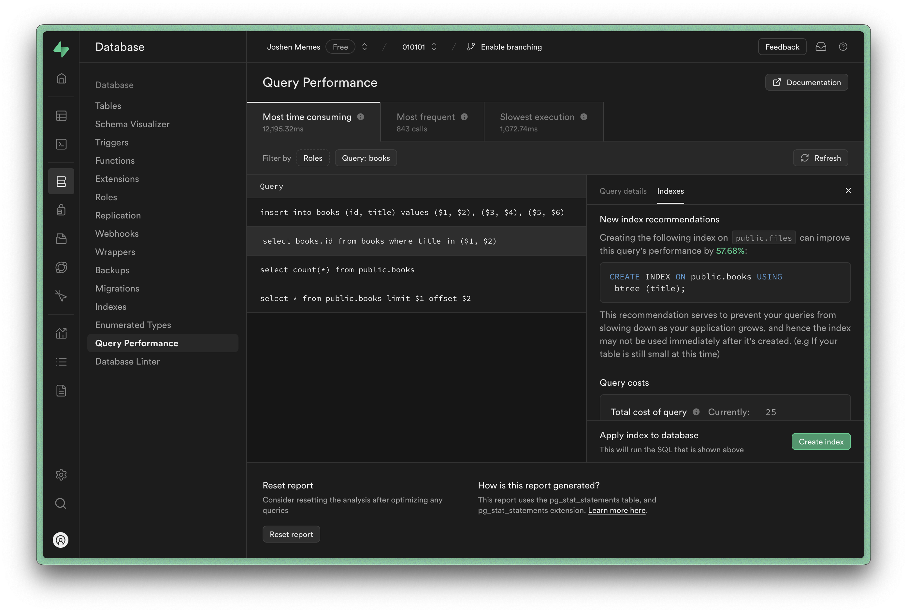

# PostgreSQL Index Advisor

<p>
<a href=""></a>
<a href="https://github.com/supabase/index_advisor/blob/master/LICENSE"></a>
<a href="https://github.com/supabase/index_advisor/actions"></a>

</p>

A PostgreSQL extension for recommending indexes to improve query performance.



## Features

- Supports generic parameters e.g. `$1`, `$2`
- Supports materialized views
- Identifies tables/columns obfuscaed by views


## API

#### Description
For a given *query*, searches for a set of SQL DDL `create index` statements that improve the query's execution time;

#### Signature
```sql
index_advisor(query text)
returns
    table  (
        startup_cost_before jsonb,
        startup_cost_after jsonb,
        total_cost_before jsonb,
        total_cost_after jsonb,
        index_statements text[],
        errors text[]
    )
```

## Usage

For a minimal example, the `index_advisor` function can be given a single table query with a filter on an unindexed column.

```sql
create extension if not exists index_advisor cascade;

create table book(
  id int primary key,
  title text not null
);

select
    *
from
  index_advisor('select book.id from book where title = $1');

```

```markdown
 startup_cost_before | startup_cost_after | total_cost_before | total_cost_after |                  index_statements                   | errors
---------------------+--------------------+-------------------+------------------+-----------------------------------------------------+--------
 0.00                | 1.17               | 25.88             | 6.40             | {"CREATE INDEX ON public.book USING btree (title)"},| {}

(1 row)
```

More complex queries may generate additional suggested indexes

```sql
create extension if not exists index_advisor cascade;

create table author(
    id serial primary key,
    name text not null
);

create table publisher(
    id serial primary key,
    name text not null,
    corporate_address text
);

create table book(
    id serial primary key,
    author_id int not null references author(id),
    publisher_id int not null references publisher(id),
    title text
);

create table review(
    id serial primary key,
    book_id int references book(id),
    body text not null
);

select
    *
from
    index_advisor('
        select
            book.id,
            book.title,
            publisher.name as publisher_name,
            author.name as author_name,
            review.body review_body
        from
            book
            join publisher
                on book.publisher_id = publisher.id
            join author
                on book.author_id = author.id
            join review
                on book.id = review.book_id
        where
            author.id = $1
            and publisher.id = $2
    ');

```

```markdown
 startup_cost_before | startup_cost_after | total_cost_before | total_cost_after |                  index_statements                         | errors
---------------------+--------------------+-------------------+------------------+-----------------------------------------------------------+--------
 27.26               | 12.77              | 68.48             | 42.37            | {"CREATE INDEX ON public.book USING btree (author_id)",   | {}
                                                                                    "CREATE INDEX ON public.book USING btree (publisher_id)",
                                                                                    "CREATE INDEX ON public.review USING btree (book_id)"}
(3 rows)
```


## Install

Requires Postgres with [hypopg](https://github.com/HypoPG/hypopg) installed.

```sh
git clone https://github.com/supabase/index_advisor.git
cd index_advisor
sudo make install
```

## Run Tests

```sh
make install; make installcheck
```
